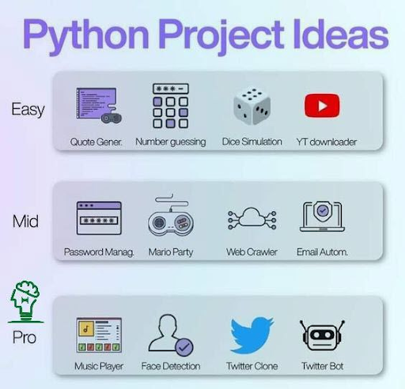

# 🐍 Python Portfolio | Abdulqayumov Abdukarim

Welcome to my Python project collection! As a **Student Developer**, I focus on building tools that are both functional and user-friendly.

## 🛠️ Project Gallery

| Project | Description |
| :--- | :--- |
| **Quote Generator** | An automated tool that generates and formats inspirational quotes. |
| **Number Guesser** | A classic logic game focusing on input validation and loop control. |
| **Dice Simulator** | A terminal-based dice game featuring custom ASCII art visualizations. |
| **YouTube Downloader** | Downloads videos/audio with progress bars and playlist support. |

---

---

## ⚙️ Setup & Installation
1. Clone the repo: `git clone https://github.com/abdulkaumovabdulkarim-blip/Python-Projects-Portfolio`
2. Install dependencies: `pip install -r requirements.txt`
